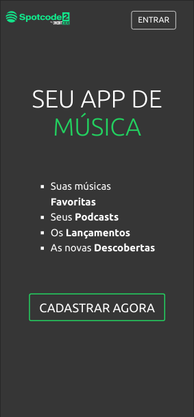
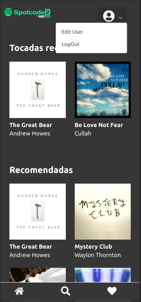
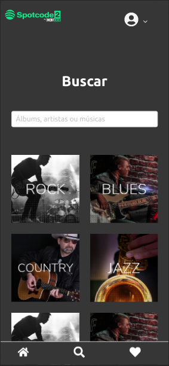
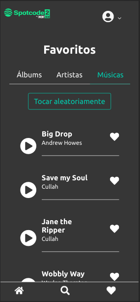

<h1 align="center">
    
</h1>

<h2 align="center">
   
🎧 SpoteCode 🎶

</h2>

  

  
  
  

  

  

  <a href="#rocket-tecnologias">Tecnologias</a>&nbsp;&nbsp;&nbsp;|&nbsp;&nbsp;&nbsp;
  <a href="#computer-projeto">Projeto</a>&nbsp;&nbsp;&nbsp;|&nbsp;&nbsp;&nbsp;
  <a href="#question-como-contribuir">Como contribuir</a>&nbsp;&nbsp;&nbsp;

 
<h3>Imagens da aplicação:<h3>

  
  
  
  

## :rocket: Tecnologias
- Ruby
- React

## :computer: Projeto
> Minicurso gratuito de PWA inspirado no Spotify com Rails e React, minustrado pela Onebitcode.

## ❗ Desafios pela frente
- Criar o component Artist
  - Exibir ele na busca
  - Exibir ele nos favoritos
- Criar a página Artist
  - Mostrar os detalhes do artista
  - Mostrar todas as músicas
  - Mostrar todos os albums
- Permitir o favorite em Artist e Album
- (Desafio Hard) Incluir um player mais robusto: https://github.com/lhz516/react-h5-audio-player#readme
## :question: Como contribuir

###### Criando Issue:
- Faça um issue nesse repositório;
- Crie novas features ou informe um bug e se possivel um link com a captura do erro;
- Aguarde até ser respondido no issue;

> Depois que o issue for concluido, ele será enviado para produção e aparecerá no github corrigido.
###### Fazendo o fork do projeto:
- Faça o fork do repositório e modifique como achar necessário;
- E se possivel me mencione na sua versão;
- E me mande uma mensagem para eu dar uma olhada;
###### Clone o projeto:
- Faça o clone no projeto e modifique como achar necessário;
- E se possivel me mencione na sua versão;
- E me mande uma mensagem para eu dar uma olhada;
